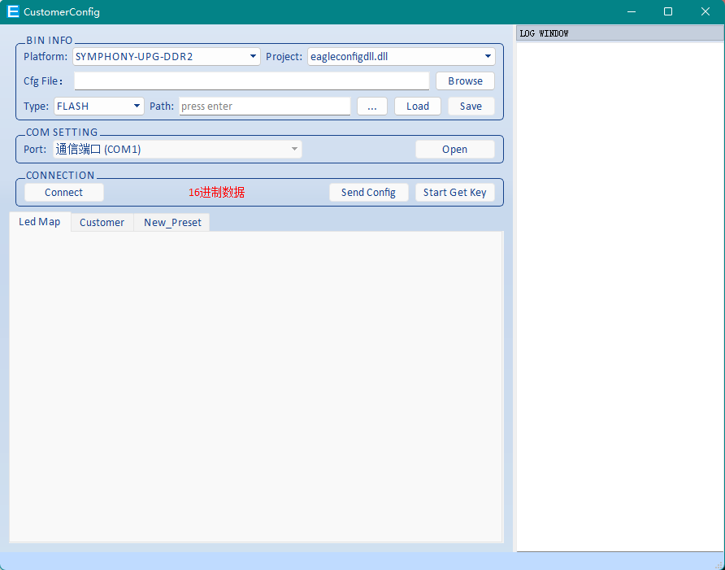
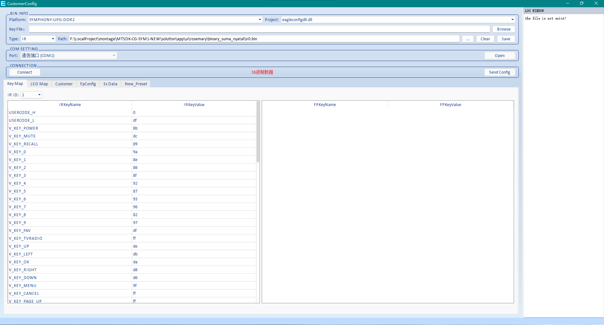

# 1.编译方法
## 1.编译步骤
1.打开`bsp\cs8000\core_symphony\config_prj\core\core_symphony\load_core_symphony_drv_open.bat`。

2.打开`solution\app\config_prj\lotus\lotus_symphony\load_lotus_symphony_full.bat`。

3.打开`solution\mw\core_symphony\config_prj\core\core_symphony\load_core_symphony_lotus.bat` 。

4.打开`solution\app\ui\rosemary\Resource\Resource\build_hd_8m128m_network.bat。`

5.打开`solution\app\config_prj\ui\symphony\rosemary\demo\hd_8m128m_adv_cryptoguard_cl\load_hd_8m128m_adv_cryptoguard_cl_last_cgc.bat`。

6.上述5步编译完后升级文件`flash.bin`生成在`solution\app\config_prj\ui\symphony\rosemary\demo\hd_8m128m_adv_cryptoguard_cl\`目录下。
## 2.注意事项
1.编译UI时选择`tools\ui_tool\Lark_881`下面的工具，选择高版本工具可能会导致某些UI显示不出来。
2.修改UI时选择的工程文件为：`solution\app\ui\rosemary\Resource\Resource\rosemary_ui.mprj`。
# 3.mpg或m2v高清logo制作方法
## 1.软件路径：`F:\LocalProject\ALI_TOOLS\Gen_Logo\3527_Boot_Logo_制作工具\TMPGEnc.exe`
## 2.使用方法
### 1.输入的图片需要是`jpg`格式(可以用PS转换一下)
### 2.按照下图配置

### 3.按照下图生成后缀为.m2v的二进制文件(如果需要mpg直接改后缀即可)

# 4.如何修改澜起公版的初始化数据
## 1.打开工程`F:\LocalProject\montage\MTSDK-CG-SYM1-NEW\solution\app\internal_tools\ssdata_tool\ss_gen.sln`
## 2.编辑`ss_gen.cpp`文件(修改相应的初始化数据)
## 3.生成解决方案并运行，在同级目录下生成`ss_data2.bin`
## 4.将`ss_data2.bin`拷贝至`F:\LocalProject\montage\MTSDK-CG-SYM1-NEW\solution\app\ui\rosemary\binary_suma`并重命名为`ss_data.bin`
## 5.重新打开编译的最后一步，重新编译(脚本需要将此文件重新拷贝)
## 6.注意需要使用`visual studio2008`编译
# 5.flash.cfg的源位置
`F:\LocalProject\montage\MTSDK-CG-SYM1-NEW\solution\app\ui\rosemary\customer\symphony\demo\hd_8m128m_adv_sumavision20_cl\binary`
# 6.logo拷贝的源位置
`F:\LocalProject\montage\MTSDK-CG-SYM1-NEW\solution\app\ui\rosemary\binary_suma`
# 7.澜起公版OTA升级流制作方法
## 1.`F:\LocalProject\montage\MTSDK-CG-SYM1-NEW\solution\app\internal_tools\mis_option\misoption.cpp`中的`misc->ota_tdi.sw_version = 0x0001;`改为`  misc->ota_tdi.sw_version = 0x0002;`
编译出`flash.bin`备用。
## 2.打开`Eagle_2594`选择`ota_editor`

### 1.`upg_flash_file`处选择刚刚编译出的`flash.bin`
### 2.`Upgrade PID`填入`7000`的16进制(`1b58`)
### 3.`SW Verswion`处填入`2`
### 4.`Upg block select`处选择`maincode`
### 5.`Create File Path`处选择生成OTA流的位置
### 6.选择`create Upg File`生成OTA升级流
### 7.放到码流卡上进行播放
# 8.澜起公版如何修改遥控器键值
## 1.打开`Eagle_2594`选择`Customcoonfig`.

## 3.首先将`F:\LocalProject\montage\MTSDK-CG-SYM1-NEW\solution\app\ui\rosemary\binary_suma_nyatal\3766.bin`另存为`ir0.bin`
## 2.Type处选择`IR`,`Path`处选择`ir0.bin`然后点击`load`.
## 3.出现如下图片，然后开始编辑键值

## 4.编译完成后点击保存，放回到原处，重命名为3766.bin,然后重新打开需要编译UI的最后一步 (需要重新拷贝)