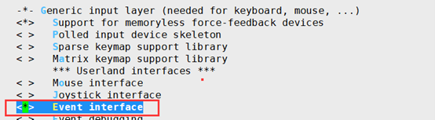
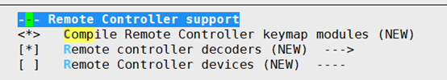

# 1.文件目录结构说明

> ·
>
> |------ linux			 	//内核部分
>
> |------ chromiumBrowser	    //浏览器部分
>
> ​	|------ launcher		   //浏览器UI
>
> ​	|------ release_browser      //浏览器依赖库(澜起提供)
>
> ​	|------ weblink		     //浏览器源码
>
> |------ sdkproduct		       //APP部分
>
> ​	|------ mico			 //APP
>
> ​		|------ APP_DVBS      //APP源码
>
> ​		|------ make	        //APP编译环境
>
> ​	|------ plugin		        //插件
>
> ​	|------ webPortingUnitTest //用于测试dvb_web_porting的单元测试程序

> 项目地址 : git@192.168.5.92:sym4_ddk

# 2.Chromium部分

## 2.1编译步骤(192.168.5.31编译)

### 1.source envsetup symphony4_512.cfg

### 2.在`linux`目录下执行`make kernel_menuconfig`进入如下图的配置界面

#### 1.Device Drivers-->Input device support choose Event interface



### 2. Device Drivers-->Remote Controller support



### 3.make clean

### 4.make(make 完成后需要重新给板子烧录内核)

### 5.拷贝文件(在chromiumBrowser目录下执行以下命令)

#### 1.`mkdir -p ./arm`

#### 2. cp -rf ../linux/opensource-2nd/output/arm/* ./arm

#### 3.cp -rf ../linux/pub/shared_lib_striped/* ./arm/lib

#### 4.cp -rf  ./release_browser/libhwb_media.a ./arm/lib

### 6.修改`chromiumBrowser/weblink`下的`compile_browser.sh`然后`./compile_browser.sh`执行

```shell
#!/bin/sh

ROOT_WEBLINK_PATH=`(pwd)`

echo "--------------compile browser start----------------"

export SDK_DIR=${ROOT_WEBLINK_PATH}/../../linux
export PATH=$PATH:/home/zhidong/toolchains/gcc-arm-8.3-2019.03-x86_64-arm-linux-gnueabihf/bin
export PKG_CONFIG_PATH=${ROOT_WEBLINK_PATH}/../arm/lib/pkgconfig
export OUTDIR=${ROOT_WEBLINK_PATH}/../arm
export PRIVATE_LOCAL_PATH=${ROOT_WEBLINK_PATH}
export USE_GPU="false"
export USE_MULTIFS="false"
export CROSS="arm-linux-gnueabihf"
export USER_CFLAGS=" -mtune=cortex-a7 -march=armv7-a -mfloat-abi=hard -mfpu=neon-vfpv4 -DLINUX_OS" ;
export USE_APPMAN="false"
export USE_DVB_SUPPORT="false"

./build/build_chromium.sh symphony4 linux embedded content_shell

#cd src; pwd;
./build/build_install_linux.sh symphony4 linux embedded 
```

## 2.2.如何把浏览器跑起来(U盘)？

### 1.首先将`chromiumBrowser/arm`下的文件夹的bin文件夹和lib文件夹拷贝至U盘下的arm文件夹下(没有的话自己新建一个)，同样将`chromiumBrowser/weblink`的res文件夹和font拷贝至U盘下的arm文件夹下,将`chromiumBrowser/weblink`的`ca.pem`拷贝至U盘的`arm/bin`目录下

### 2.自己写一个启动脚本放在`arm/bin/browser`，内容如下：

```shell
#!/bin/sh
echo "--------------start browser start----------------"
if [ $# == 1 ]
then
  startparam="--disable-gpu --allow-file-access-from-files $1"
else
  startparam="$*"
fi
startparam=${1}

if [ ! -d "/dev/shm" ];then
  mkdir /dev/shm
fi

export USER_AGENT="Mozilla/5.0 (X11; Linux armv7l) Cobalt/21.master.0.301323-qa (unlike Gecko) v8/8.8.278.8-jit blitter Starboard/11, _UNKNOWN__/ (Raspberry Pi Foundation, , )"

export LD_LIBRARY_PATH=/media/sda1/arm/lib:$LD_LIBRARY_PATH
export FONTCONFIG_PATH=/media/sda1/arm/font/etc/fonts
export FONTCONFIG_FILE=/media/sda1/arm/font/etc/fonts/fonts.conf
export FC_CACHEDIR=/media/sda1/arm/font/data/data/browser/cache/fontconfig
export DFBARGS=system=fbdev,depth=32,mode=1280x720,layer-size=1280x720,pixelformat=ARGB,desktop-buffer-mode=frontonly,module-dir=/media/sda1/arm/lib/directfb-1.7-7
export CA_PEM_NAME=/media/sda1/arm/bin/ca.pem

echo "$startparam"

exec ./content_shell --no-sandbox  \
                --disable-setuid-sandbox\
                --enable-logging=stderr \
                --v=1  \
                --single-process \
                --ozone-platform=directfb \
                --ui-disable-threaded-compositing  \
                --enable-spatial-navigation  \
                --no-zygote  \
				--ignore-certificate-errors \
				--enable-transparent-visuals \
                --allow-file-access-from-files  \
				--autoplay-policy=no-user-gesture-required \
                $startparam

```

### 3.修改U盘的`arm\font\etc\fonts`文件夹中的`fonts.conf`,找到下列两行并修改：

```xml
<dir>/media/sda1/arm/res/font/ttf</dir><cachedir>/media/sda1/arm/font/data/data/browser/cache/fontconfig</cachedir>
```

### 4.插入U盘后执行以下命令

 ```shell
 export LD_LIBRARY_PATH=/media/sda1/arm/lib:$LD_LIBRARY_PATH
 ```

### 5.进入`media/sda1/bin/browser`目录

```shell
./start.sh XXXXXXXXXXXXX
```

> 其中XXXXXXXXXXXXX为任意的网址或者本地的网页文件，例如./start.sh https://www.google.com
>
> 如果需要访问网页，则需要先执行udhcpc进行有线连接后再访问

## 2.3如何让浏览器变透明？

编译完成后的arm/bin/browser目录下会有一个启动脚本，修改为如下内容 : 

```shell
echo "--------------start browser start----------------"

startparam=""
if [ $# == 1 ];then
  startparam="--disable-gpu --allow-file-access-from-files $1"
else
  startparam="$*"
fi
if [ $# == 0 ];then
  startparam="file:///mnt/nfs/git/sym4_ddk/chromiumBrowser/launcher/launcher.html"
else
  startparam=${1}
fi
if [ ! -d "/dev/shm" ];then
  mkdir /dev/shm
fi

echo "$startparam"

export USER_AGENT="Mozilla/5.0 (X11; Linux armv7l) Cobalt/21.master.0.301323-qa (unlike Gecko) v8/8.8.278.8-jit blitter Starboard/11, _UNKNOWN__/ (Raspberry Pi Foundation, , )"
export LD_LIBRARY_PATH=/mnt/nfs/git/sym4_ddk/chromiumBrowser/arm/lib:$LD_LIBRARY_PATH
export FONTCONFIG_PATH=/mnt/nfs/git/sym4_ddk/chromiumBrowser/weblink/font/etc/fonts
export FONTCONFIG_FILE=/mnt/nfs/git/sym4_ddk/chromiumBrowser/weblink/font/etc/fonts/fonts.conf
export FC_CACHEDIR=/mnt/nfs/git/sym4_ddk/chromiumBrowser/weblink/font/data/data/browser/cache/fontconfig
export DFBARGS=system=fbdev,depth=32,mode=1280x720,layer-size=1280x720,pixelformat=ARGB,desktop-buffer-mode=frontonly,module-dir=/mnt/nfs/git/sym4_ddk/chromiumBrowser/arm/lib/directfb-1.7-7
export CA_PEM_NAME=/mnt/nfs/git/sym4_ddk/chromiumBrowser/weblink/ca.pem

exec ./content_shell  --no-sandbox \
                     --disable-setuid-sandbox \
                     --enable-logging=stderr \
                     --v=0 \
                     --single-process \
                     --ozone-platform=directfb \
                     --ui-disable-threaded-compositing \
                     --enable-spatial-navigation \
                     --no-zygote \
				    --ignore-certificate-errors \
				    --enable-transparent-visuals \
                     --allow-file-access-from-files \
				    --autoplay-policy=no-user-gesture-required \
                     $startparam

```

在`exec ./content_shell`之后增加参数`--enable-osd-transparent` 可以使浏览器完全透明

## 2.4如何加载插件？

在`exec ./content_shell`之后增加参数`-register-pepper-plugins="libplugin.so;application/x-ppapi-ConfigPlug" \` 可以使浏览器加载libplugin.so这个插件，其中`application/x-ppapi-ConfigPlug`为自定义名字，需要在js代码种去调用，调用示例如下：

```js
function pp_initConfigPlug() {
	var pluginElement = document.createElement('object');
	pluginElement.id = 'pp_configplugin';
	pluginElement.type = 'application/x-ppapi-ConfigPlug';
	document.body.appendChild(pluginElement);
}
```

### 2.4.1如何在浏览器种调用插件？

以获取系统信息和设置为例

```js
function sendMessage(msg) {
  return new Promise((resolve, reject) => {
  	var plugin = document.getElementById('pp_configplugin'); 
    plugin.postMessage(msg);
    plugin.addEventListener('message', event => {
      const messageArray = Array.from(event.data);
	console.log('Received message:', messageArray);	
	var method = messageArray[0];
	console.log(method);	
      if(method === msg.method) {
	  	var result = messageArray[1];
		console.log(result);
		resolve(result);
      }
    }); 
  });
}
function pp_getProperty(key) {
  return sendMessage({
    method: 'getProperty',
    params: key
  })
  .then(result => {
  	console.log(result, typeof result);
    return result;
  })
  .catch(error => {
  	console.error(error);
  });
}
function pp_setProperty(key, value) 
{
  return sendMessage({
    method: 'setProperty',
    params: [key, value]
  })
  .then(result => {
  	console.log(result, typeof result);
    return result;
  })
  .catch(error => {
  	console.error(error);
  });
}
```

只需要关注此部分即可

```js
sendMessage({
    method: 'setProperty',
    params: [key, value]
  })
```

1. `method: 'setProperty'`为调用的插件中的函数名字
2. `params: [key, value]`为需要传给插件的参数(可以为任意类型)

### 2.4.2 插件中如何处理浏览器种传来的消息？

在`Instance_HandleMessage`函数中，如下代码为处理传来的消息

```c
//全部为string类型的参数的处理
if (strncmp(methodName, "getProperty", len) == 0)
{
  struct PP_Var argsVar = ppb_var_interface->VarFromUtf8("params", strlen("params"));
  struct PP_Var args = ppb_var_dict_interface->Get(message, argsVar);
  if (args.type == PP_VARTYPE_STRING)
  {
    const char *Parameter = ppb_var_interface->VarToUtf8(args, &len);
    getProperty(instance, methodName, Parameter);
  }
}
else if (strncmp(methodName, "setProperty", len) == 0)
{
  struct PP_Var argsVar = ppb_var_interface->VarFromUtf8("params", strlen("params"));
  struct PP_Var args = ppb_var_dict_interface->Get(message, argsVar);
  if (args.type == PP_VARTYPE_STRING)
  {
    const char *Parameter = ppb_var_interface->VarToUtf8(args, &len);
    getProperty(instance, methodName, Parameter);
  }
}
//带有不同类型参数的处理
else if (strncmp(methodName, "PlayChannel", len) == 0)
{
  struct PP_Var argsVar = ppb_var_interface->VarFromUtf8("params", strlen("params"));
  struct PP_Var args = ppb_var_dict_interface->Get(message, argsVar);

  struct PP_Var arg0 = ppb_var_array_interface->Get(args, 0);
  struct PP_Var arg1 = ppb_var_array_interface->Get(args, 1);
  struct PP_Var arg2 = ppb_var_array_interface->Get(args, 2);
  struct PP_Var arg3 = ppb_var_array_interface->Get(args, 3);

  int v1 = arg0.value.as_int;
  int v2 = arg1.value.as_int;
  bool b = arg2.value.as_bool;
  const char *Parameter = ppb_var_interface->VarToUtf8(arg3, &len);

  playChannel(instance, methodName, v1, v2, b, Parameter);
}
else if (strncmp(methodName, "resetVideoSize", len) == 0)
{
  struct PP_Var argsVar = ppb_var_interface->VarFromUtf8("params", strlen("params"));

  struct PP_Var args = ppb_var_dict_interface->Get(message, argsVar);

  struct PP_Var arg0 = ppb_var_array_interface->Get(args, 0);
  struct PP_Var arg1 = ppb_var_array_interface->Get(args, 1);
  struct PP_Var arg2 = ppb_var_array_interface->Get(args, 2);
  struct PP_Var arg3 = ppb_var_array_interface->Get(args, 3);

  int x = arg0.value.as_int;
  int y = arg1.value.as_int;
  int w = arg2.value.as_int;
  int h = arg3.value.as_int;

  resetVideoSize(instance, methodName, x, y, w, h);
}

void getProperty(PP_Instance instance, const char *methodname, const char *strParameter)
{
    struct PP_Var resultArray = ppb_var_array_interface->Create();
    char intStr[32] = {0};
    memset(intStr, 0, sizeof(intStr));
    dvb_sys_getinfo((char*)strParameter, intStr, 32);
	
    //回传给浏览器的反馈
    ppb_var_array_interface->Set(resultArray, 0, ppb_var_interface->VarFromUtf8(methodname, strlen(methodname)));
    ppb_var_array_interface->Set(resultArray, 1, ppb_var_interface->VarFromUtf8(intStr, strlen(intStr)));
    ppb_messaging_interface->PostMessage(instance, resultArray);
}
void setProperty(PP_Instance instance, const char *methodname, const char *strParameter1, const char *strParameter2)
{
    struct PP_Var resultArray = ppb_var_array_interface->Create();

    INFO("param1 : %s | param2 : %s\n", strParameter1, strParameter2);
    dvb_sys_saveinfo((char*)strParameter1, (char*)strParameter2);
    
     //回传给浏览器的反馈
    ppb_var_array_interface->Set(resultArray, 0, ppb_var_interface->VarFromUtf8(methodname, strlen(methodname)));
    ppb_var_array_interface->Set(resultArray, 1, VarFromBOOL(true));
    ppb_messaging_interface->PostMessage(instance, resultArray);
}
```

### 2.4.3插件中调用的函数是如何发送给APP的？

```c
//socket init
static int clientSocketConfigGetHandle = -1;
static int clientSocketConfigSetHandle = -1;

void createClienthandle(char flag)
{
    struct sockaddr_in serverAddr;

    if (flag == 0)
    {
        clientSocketConfigGetHandle = socket(AF_INET, SOCK_STREAM, 0);
        if (clientSocketConfigGetHandle == -1)
        {
            perror("Error creating client socket");
            exit(EXIT_FAILURE);
        }
        else
        {
            serverAddr.sin_family = AF_INET;
            serverAddr.sin_port = htons(SOC_SERVER_CONFIG);
            if (inet_pton(AF_INET, SERVER_ADDRESS, &serverAddr.sin_addr) <= 0)
            {
                perror("Invalid server address");
                close(clientSocketConfigGetHandle);

                exit(EXIT_FAILURE);
            }

            if (connect(clientSocketConfigGetHandle, (struct sockaddr *)&serverAddr, sizeof(serverAddr)) == -1)
            {
                perror("Error connecting to server(video)");
                close(clientSocketConfigGetHandle);
                exit(EXIT_FAILURE);
            }
        }
    }
    else if (flag == 1)
    {
        clientSocketConfigSetHandle = socket(AF_INET, SOCK_STREAM, 0);
        if (clientSocketConfigSetHandle == -1)
        {
            perror("Error creating client socket");
            exit(EXIT_FAILURE);
        }
        else
        {
            serverAddr.sin_family = AF_INET;
            serverAddr.sin_port = htons(SOC_SERVER_CONFIG + 1);
            if (inet_pton(AF_INET, SERVER_ADDRESS, &serverAddr.sin_addr) <= 0)
            {
                perror("Invalid server address");
                close(clientSocketConfigSetHandle);

                exit(EXIT_FAILURE);
            }

            if (connect(clientSocketConfigSetHandle, (struct sockaddr *)&serverAddr, sizeof(serverAddr)) == -1)
            {
                perror("Error connecting to server(video)");
                close(clientSocketConfigSetHandle);
                exit(EXIT_FAILURE);
            }
        }
    }
}
```

```c
//set
int dvb_sys_saveinfo(char *key, char *value)
{
    if(clientSocketConfigSetHandle == -1)
    {
        createClienthandle(1);
    }
    if (key && value)
    {
        StringData strdata = {0, 0};
        strdata = FormatGenStringData(DVB_MODULE_NAME, NULL, DVB_SET_SYS_DATA, "string", key, "string", value, NULL);
        if (send(clientSocketConfigSetHandle,  strdata.data, strdata.len, 0) == -1)
        {
            perror("Error sending data to server");
        }
        safe_free(strdata.data);
        return 0;
    }
    return -1;
}
```

```c
//get
int dvb_sys_getinfo(char *key, char *value, int buffersize)
{
    int nRet = -1;
    StringData strdata = { 0, 0 }, result = {0, 0};
    static char buffer[1024];

    memset(buffer, 0, 1024);
    if (clientSocketConfigGetHandle == -1)
    {
        createClienthandle(0);
    } 
    if (key && value)
    {
        strdata = FormatGenStringData(DVB_MODULE_NAME, NULL, DVB_GET_SYS_DATA, "string", key, NULL);

        nRet = send(clientSocketConfigGetHandle,  strdata.data, strdata.len, 0);

        if (nRet == -1)
        {
            printf("Error sending data to server");
        }
        else
        {
            nRet = recv(clientSocketConfigGetHandle, buffer, sizeof(buffer), 0);

            char *str = 0;
            char *type = 0;

            result.data = buffer;
            result.len = strlen(buffer);
            FormatGetParameter(result, 0, &type, &str);

            if (str)
            {
                snprintf(value, buffersize, "%s", str);
            }
            safe_free(str);
            safe_free(type);
        }
        safe_free(strdata.data);
    }
}
```

# 3.linux部分

## 3.1编译步骤(192.168.5.31编译)

### 1.source envsetup symphony4_512.cfg

### 2.make clean

### 3.make

## 3.2Linux编译注意事项

### 1.编译前先检查自己目录下的.bashrc文件中是否export了其他的工具链，如果存在，先屏蔽

### 2.不要为了加快速度去执行make -j32，极有可能会导致编译失败，老老实实make即可

### 3.可以单独的编译某一个模块，具体可以使用make help查看有哪些模块可以单独编译

## 3.3如何烧录内核(xshell工具)

### 1.将`linux\image\boston\output-board_bga_std_v20`目录下的`update_fta30`整个文件夹拷贝到U盘

### 2.插入U盘后上电长按回车进入UBOOT，`工具->脚本->运行`选择烧录脚本，脚本如下：

```vbs
' This automatically generated script may need to be
' edited in order to work correctly.

Sub Main
	xsh.Screen.Synchronous = True
	xsh.Screen.Send "usb start" & chr(13)
	xsh.Screen.WaitForString "USB Device(s) found"

	'erase all
	xsh.Screen.Send "nand scrub.chip" & chr(13)
	xsh.Screen.WaitForString "<y/N>"
	xsh.Screen.Send "y" & chr(13)
	xsh.Screen.WaitForString "successfully!"

	'btinit+uboot: 4M
	xsh.Screen.Send "fatload usb 0 0x02000000 update_fta30/symphony4_ddr3_1866M_autoboot_all.img" & chr(13)
	xsh.Screen.WaitForString "bytes read"

	'erase
	xsh.Screen.Send "nand erase 0 0x400000" & chr(13)
	xsh.Screen.WaitForString "successfully!"

	xsh.Screen.Send "nand write 0x02000000 0 $filesize" & chr(13)
	xsh.Screen.WaitForString "written: OK"

	'bootargs: 512K, 64k in fact
	xsh.Screen.Send "nand erase 0x400000 0x80000" & chr(13)
	xsh.Screen.WaitForString "successfully!"

	xsh.Screen.Send "fatload usb 0 0x02000000 update_fta30/uboot_symphony_demo_rawnand_encrypt.scr" & chr(13)
	xsh.Screen.WaitForString "bytes read"

	xsh.Screen.Send "nand write 0x02000000 0x400000 $filesize" & chr(13)
	xsh.Screen.WaitForString "written: OK"

	'pin: 512K, 64k in fact, 4.5-5
	xsh.Screen.Send "fatload usb 0 0x02000000 update_fta30/uboot_symphony_pinctrl.scr" & chr(13)
	xsh.Screen.WaitForString "bytes read"

	xsh.Screen.Send "nand erase 0x480000 0x80000" & chr(13)
	xsh.Screen.WaitForString "successfully!"

	xsh.Screen.Send "nand write 0x02000000 0x480000 $filesize" & chr(13)
	xsh.Screen.WaitForString "written: OK"

	'logo: 2M, 5-7
	xsh.Screen.Send "nand erase 0x500000 0x200000" & chr(13)
	xsh.Screen.WaitForString "successfully!"	

	xsh.Screen.Send "fatload usb 0 0x02000000 update_fta30/logo.jpg" & chr(13)
	xsh.Screen.WaitForString "bytes read"

	xsh.Screen.Send "nand write 0x02000000 0x500000 $filesize" & chr(13)
	xsh.Screen.WaitForString "written: OK"

	'av_cpu: 2M, 7-9
	xsh.Screen.Send "nand erase 0x700000 0x200000" & chr(13)
	xsh.Screen.WaitForString "successfully!"

	xsh.Screen.Send "fatload usb 0 0x02000000 update_fta30/av_cpu256m_sym4_encrypt.bin" & chr(13)
	xsh.Screen.WaitForString "bytes read"

	xsh.Screen.Send "nand write 0x02000000 0x700000 $filesize" & chr(13)
	xsh.Screen.WaitForString "written: OK"

	'uImage-upg: 6M, 9-15
	xsh.Screen.Send "nand erase 0x900000 0x600000" & chr(13)
	xsh.Screen.WaitForString "successfully!"

	xsh.Screen.Send "fatload usb 0 0x02000000 update_fta30/uImage-dtb-loader" & chr(13)
	xsh.Screen.WaitForString "bytes read"

	xsh.Screen.Send "nand write 0x02000000 0x900000 $filesize" & chr(13)
	xsh.Screen.WaitForString "written: OK"
	
	'rootfs-upg: 10M, 15-25
	xsh.Screen.Send "nand erase 0xF00000 0xA00000" & chr(13)
	xsh.Screen.WaitForString "successfully!"

	xsh.Screen.Send "fatload usb 0 0x02000000 update_fta30/loader_rootfs.squashfs" & chr(13)
	xsh.Screen.WaitForString "bytes read"

	xsh.Screen.Send "nand write 0x02000000 0xF00000 $filesize" & chr(13)
	xsh.Screen.WaitForString "written: OK"	
	
	'uImage-dtb: 15M, 25-40
	xsh.Screen.Send "nand erase 0x1900000 0xF00000" & chr(13)
	xsh.Screen.WaitForString "successfully!"

	xsh.Screen.Send "fatload usb 0 0x02000000 update_fta30/uImage-dtb" & chr(13)
	xsh.Screen.WaitForString "bytes read"

	xsh.Screen.Send "nand write 0x02000000 0x1900000 $filesize" & chr(13)
	xsh.Screen.WaitForString "written: OK"

	'rootfs: 18M, 40-58
	xsh.Screen.Send "nand erase 0x2800000 0x1200000" & chr(13)
	xsh.Screen.WaitForString "successfully!"

	xsh.Screen.Send "fatload usb 0 0x02000000 update_fta30/rootfs.img" & chr(13)
	xsh.Screen.WaitForString "bytes read"

	xsh.Screen.Send "nand write 0x02000000 0x2800000 $filesize" & chr(13)
	xsh.Screen.WaitForString "written: OK"

	'usrfs: 50M, 58-108
	xsh.Screen.Send "nand erase 0x3A00000 0x3200000" & chr(13)
	xsh.Screen.WaitForString "successfully"

	xsh.Screen.Send "fatload usb 0 0x02000000 update_fta30/usrfs.img" & chr(13)
	xsh.Screen.WaitForString "bytes read"

	xsh.Screen.Send "nand write 0x02000000 0x3A00000 $filesize" & chr(13)
	xsh.Screen.WaitForString "written: OK"

	'ubi data: 15M, 108-123
	xsh.Screen.Send "nand erase 0x6C00000 0xF00000" & chr(13)
	xsh.Screen.WaitForString "successfully"
	
	xsh.Screen.Send "fatload usb 0 0x02000000 update_fta30/nandubi.img" & chr(13)
	xsh.Screen.WaitForString "bytes read"

	xsh.Screen.Send "nand write 0x02000000 0x6C00000 $filesize" & chr(13)
	xsh.Screen.WaitForString "written: OK"

	'loader-db: 4M, 123-127
	xsh.Screen.Send "nand erase 0x7B00000 0x400000" & chr(13)
	xsh.Screen.WaitForString "successfully"

	xsh.Screen.Send "fatload usb 0 0x02000000 update_fta30/nandubi_loaderdb.img" & chr(13)
	xsh.Screen.WaitForString "bytes read"

	xsh.Screen.Send "nand write 0x02000000 0x7B00000 $filesize" & chr(13)
	xsh.Screen.WaitForString "written: OK"

	'yaffs2 data: 10M, 127-137
	xsh.Screen.Send "nand erase 0x7F00000 0xA00000" & chr(13)
	xsh.Screen.WaitForString "successfully"

	xsh.Screen.Send "fatload usb 0 0x02000000 update_fta30/nanddatafs.yaffs2" & chr(13)
	xsh.Screen.WaitForString "bytes read"

	xsh.Screen.Send "nand write 0x02000000 0x7F00000 $filesize" & chr(13)
	xsh.Screen.WaitForString "written: OK"
End Sub

```

## 3.4opensource-2nd部分如何增加新模块编译？

修改opensource-2nd下的makefile如下所示(仅示例部分内容，示例：增加dbus模块)

```makefile
step1:
	$(MAKE) directfb
ifeq ($(CONFIG_MT_GSTPLAYER_ENABLE),y)
	$(MAKE) gstreamer
endif
ifeq ($(CONFIG_BLUEZ_SUPPORT),y)
	$(MAKE) bluez
endif
	$(MAKE) tinyxml
	$(MAKE) -f $(CURRENT_MAKEFILES) -r step1_install
	$(MAKE) dbus
	
······

step1_install:
	$(MAKE) directfb_install
ifeq ($(CONFIG_MT_GSTPLAYER_ENABLE),y)
	$(MAKE) gstreamer_install
endif
ifeq ($(CONFIG_BLUEZ_SUPPORT),y)
	$(MAKE) bluez_install
endif
	$(MAKE) tinyxml_install
	$(MAKE) dbus_install
```

然后回到linux目录make clean然后再make

# 4.APP部分

## 4.1编译部分(192.168.5.31编译)

配置环境，在sdkproduct/mico目录下执行下面的命令

```shell
source setenv.sh customer=demosym4 chipsub=symphony4

make clean

make
```

# 5.调试(GDB)

## 5.1如何将GDB编译到kernel？

```shell
source envsetup symphony4_512.cfg

make clean

make menuconfig
```

选择`debug support -> install gdbserver into rootfs`会将GDB编译到rootfs中(nfs挂载也可用)，如果需要在U盘中运行则需要把`install gdbserver and perf into usb storage`也勾选上

```shell
make
```

## 5.2如何调试？

### 5.2.1如何在U盘上运行？

在Linux目录下有debug_tools_install_path,将其拷贝到U盘

```shell 
export PATH=$PATH:/media/sda1/debug_tools_install_path/usr/bin
export LD_LIBRARY_PATH=$LD_LIBRARY_PATH:/media/sda1/debug_tools_install_path/usr/lib
```

## 5.3如何通过nfs来运行？

### 5.3.1 运行APP

```shell
export LD_LIBRARY_PATH=/mnt/nfs/git/sym4_ddk/sdkproduct/mico/APP_DVBS/external_lib:$LD_LIBRARY_PATH \

mkdir /mnt/nfs && udhcpc && mount -t nfs -o intr,nolock,rsize=1024,wsize=1024 192.168.5.31:/home/gengnx /mnt/nfs && cd /mnt/nfs/git/sym4_ddk/sdkproduct/mico/test && ./symphony.bin html_ui &
```

### 5.3.2 运行浏览器

```shell
cd /mnt/nfs/git/sym4_ddk/chromiumBrowser/arm/bin/browser/ && ./launcher.sh
```

### 5.3.3运行web_porting的单元测试

```shell
cd /mnt/nfs/git/sym4_ddk/sdkproduct/webPortingUnitTest && ./client
```

 

